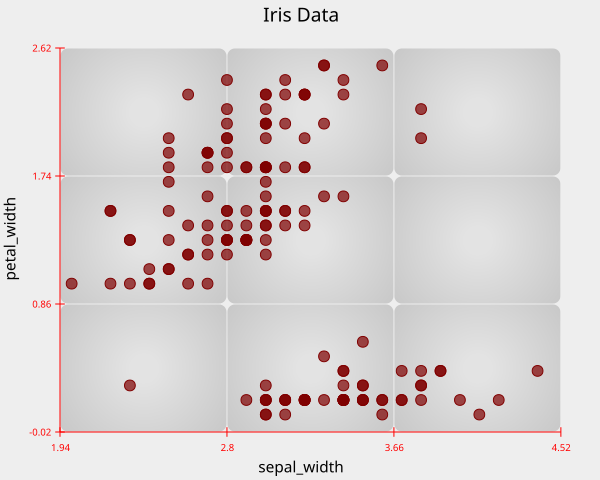

# Axes

The `axes` component is used to control the appearance and behavior of
the x- and y-axes. It supports **six** parameters:

-   `color`
-   `style`
-   `alpha`
-   `x_tic`
-   `y_tic`
-   `sig_digits`

------------------------------------------------------------------------

## `color`

The `color` parameter accepts:

-   a **color name** (e.g., `"red"`, `"sky"`, `"teal"`), or\
-   a **hex code** (e.g., `"#00AFDB"`).

If not provided, ReyPlot automatically uses the color **black**.

``` python
import reyplot as rp

data_set = rp.load_dataset("iris")

chrt = rp.chart()
chrt.scatter(data=data_set, x="sepal_width", y="petal_width")
chrt.axes(color="red")
chrt.title(title="Iris Data")

chrt.show()
```



------------------------------------------------------------------------

## `style`

The `style` parameter accepts a **string**.\
Two styles are available:

-   `"two_lines"`
-   `"boxed"`

``` python
chrt.axes(style="boxed")
```

------------------------------------------------------------------------

## `alpha`

Controls the opacity of the axes.\
Takes a `float` between **0 and 1**.\
Default value: **1**.

``` python
chrt.axes(alpha=0.5)
```

------------------------------------------------------------------------

## `x_tic` & `y_tic`

The `x_tic` and `y_tic` parameters take positive **integer** values.\
Default value: **4**.

``` python
chrt.axes(x_tic=7, y_tic=5)
```

------------------------------------------------------------------------

## `sig_digits`

The `sig_digits` parameter takes a positive **integer** and controls the
number of significant digits shown on the axes.\
Default value: **3**.

``` python
chrt.axes(sig_digits=5)
```

