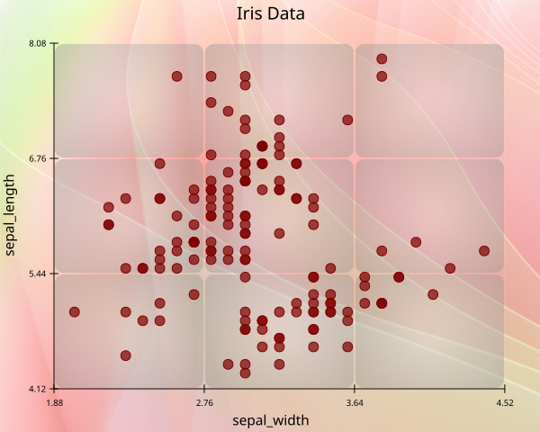

# Background Image
The `background_image` method currently supports only **2** parameter.

- `path`
- `blur`

---

## `path`

The `path` parameter accepts **str** directory of the image.

``` Python
import reyplot as rp 

df = rp.load_dataset("iris")

iris = rp.chart()

iris.scatter(data = df,
             x = "sepal_width",
             y = "sepal_length"
             )

iris.title("Iris Data")
iris.background_image(path = "background.jpg")

iris.show()
```



----

## `blur`
The `blur` parameter accepts **float** values.  
The default value of `blur` is **0**

``` Python
iris.background_image(path = "background.jpg", blur = 3)
```