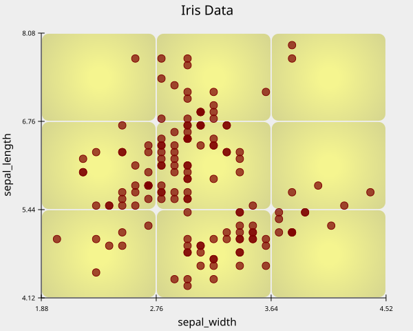

# Block Grid
The `block_grid` method currently supports **6** parameters.

- `color`
- `gradient`
- `gradient_color`
- `alpha`
- `radius`
- `display`

------

## `color`

The `color` parameter accepts:

- a **color name** (e.g., `"red"`, `"sky"`, `"teal"`), or  
- a **hex code** (e.g., `"#00AFDB"`).

The default value of the `color` is `"#D1D1D1"`

``` Python 
import reyplot as rp 

df = rp.load_dataset("iris")

iris = rp.chart()

iris.scatter(data = df,
             x = "sepal_width",
             y = "sepal_length"
             )
iris.title("Iris Data")
iris.block_grid(color = "yellow")
iris.show()
```

---


## `gradient`

The `gradient` parameter accepts **bool** value.  
The Defualt value is **True**

``` Python
iris.block_grid(color = "yellow", gradient = False)
```
----

## `gradient_color`


The `gradient_color` parameter accepts:

- a **color name** (e.g., `"red"`, `"sky"`, `"teal"`), or  
- a **hex code** (e.g., `"#00AFDB"`).

If not provided, ReyPlot automatically assigns `"black"` color.

``` Python
iris.block_grid(color = "yellow", gradient_color = "red")
```
---

## `alpha`

Controls the opacity of the scatter points.  
Takes a `float` between **0 and 1**.  
Default value: **0.4**.

``` Python
iris.block_grid(color = "yellow", alpha = 1)
```

---

## `radius`

The `radius` parameter takes float values.  
The default value of `radius` is **1**

``` Python
iris.block_grid(radius = 0)
```
---

## `display`

The `display` parameter takes **bool** value.   
The default value of `display` is **True**

``` Python
iris.block_grid(display = False)
```