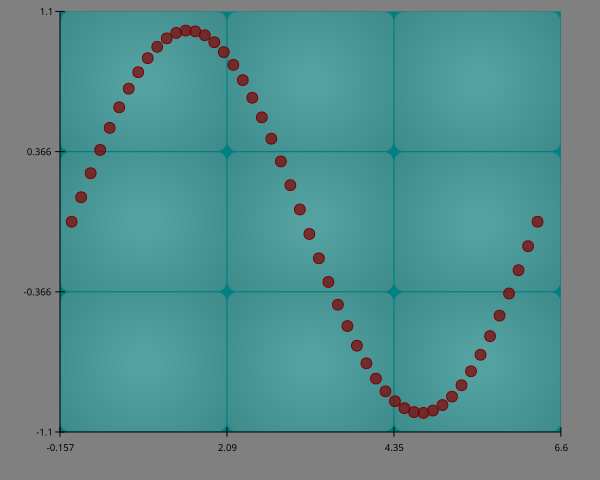

# Layers
The ReyPlot consists of 2 Layers `inner_layer` and `outter_layer`.   
The both methods currently supports **4** parameters.

- `color`
- `gradient`
- `gradient_color`
- `alpha`
---

## `color`

The `color` parameter accepts:

- a **color name** (e.g., `"red"`, `"sky"`, `"teal"`), or  
- a **hex code** (e.g., `"#00AFDB"`).

If not provided, ReyPlot automatically assigns `"#EEEEEE"` color.

``` Python
import reyplot as rp
import numpy as np

x = np.linspace(0, 2*np.pi, 50)
y = np.sin(x)

chrt = rp.chart()
chrt.scatter(x = x, y = y)
chrt.inner_layer(color = "teal")
chrt.outer_layer(color = "gray")
chrt.show()
```



## `gradient`

The `gradient` parameter accepts **bool** value.  
The Defualt value is **False**

``` Python
chrt.inner_layer(color = "teal", gradient = True)
chrt.outer_layer(color = "gray", gradient = False)
```
---

## `gradient_color`


The `gradient_color` parameter accepts:

- a **color name** (e.g., `"red"`, `"sky"`, `"teal"`), or  
- a **hex code** (e.g., `"#00AFDB"`).

If not provided, ReyPlot automatically assigns `"black"` color.

``` Python
chrt.inner_layer(color = "teal", gradient = True, gradient_color = "red")
chrt.outer_layer(color = "gray", gradient = True, gradient_color = "white")
```
---

## `alpha`

Controls the opacity of the Layers.  
Takes a `float` between **0 and 1**.  
Default value: **0**.

``` Python
chrt.inner_layer(alpha = 0.2)
chrt.outer_layer(alpha = 0.5)
```


