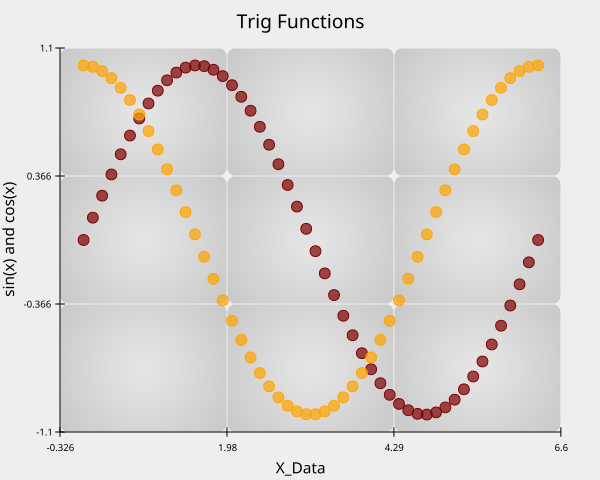
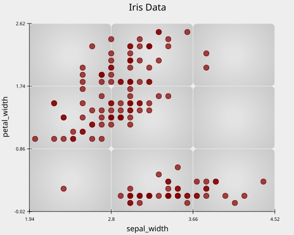

# Quick Start with ReyPlot

The Quick Start section provides two scatter plot examples: one that uses a NumPy array to plot a sine wave, and another that visualizes the Iris dataset. These examples demonstrate that ReyPlot supports both raw numerical data and structured datasets, similar to combining the flexibility of Matplotlib with the simplicity of Seaborn.

## Example 1
 ``` python
import reyplot as rp
import numpy as np

x = np.linspace(0,2*np.pi,50)
y1 = np.sin(x)
y2 = np.cos(x)

chrt = rp.chart()

chrt.scatter(x = x , y = y1)

chrt.scatter(x = x , y = y2)

chrt.x_title(x_title="X_Data")

chrt.y_title(y_title="sin(x) and cos(x)")

chrt.title(title="Trig Functions")

chrt.show()
 ```
 

 ## Example 2
 ``` python
import reyplot as rp

data_set = rp.load_dataset("iris")

chrt = rp.chart()

chrt.scatter(data = data_set ,x = "sepal_width", y = "petal_width")

chrt.title(title="Iris Data")

chrt.show()
 ```

